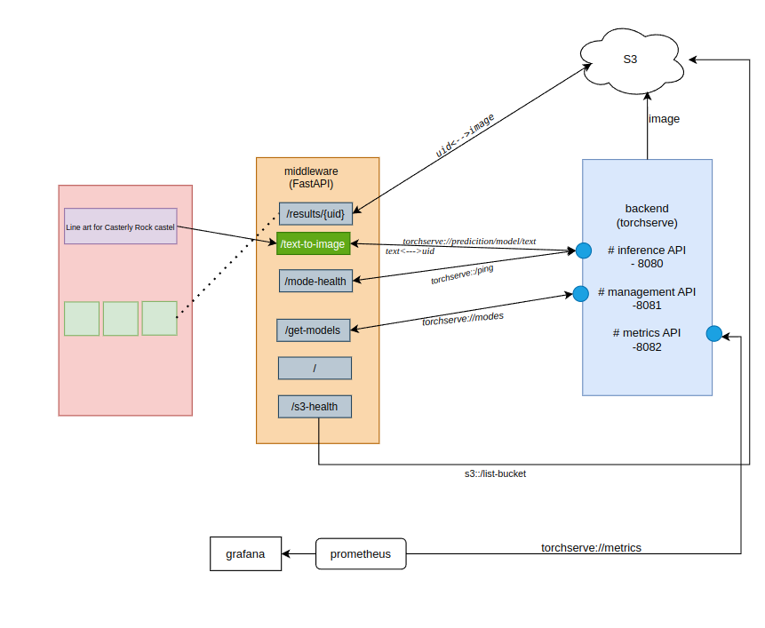
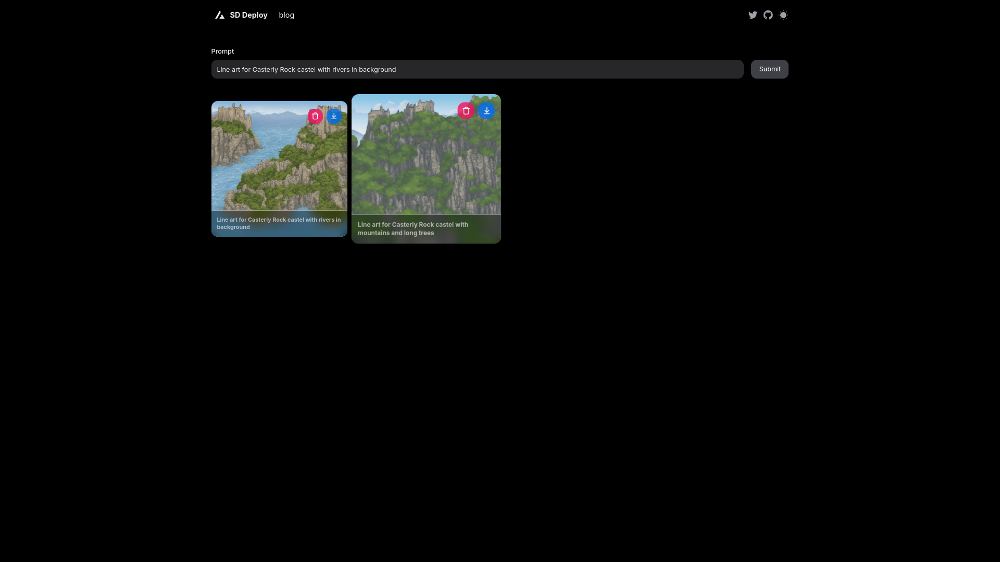
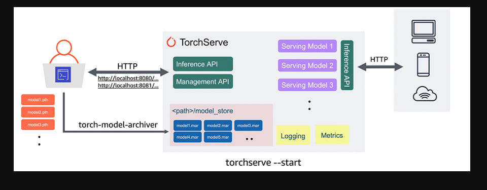
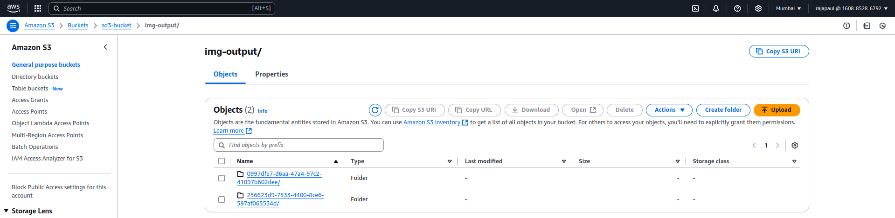
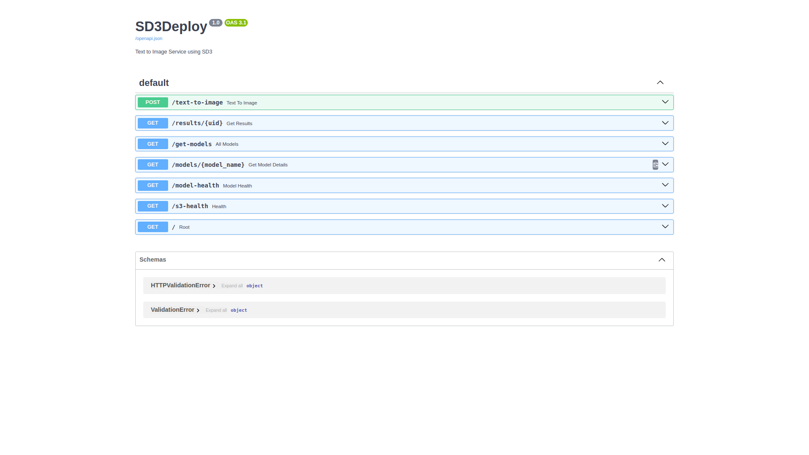
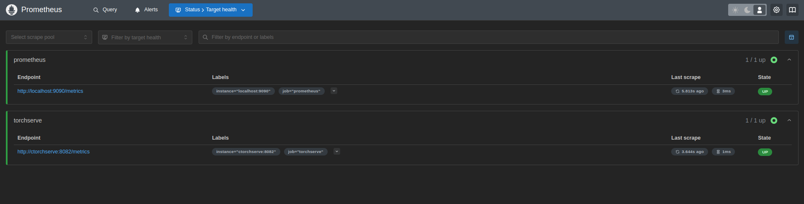
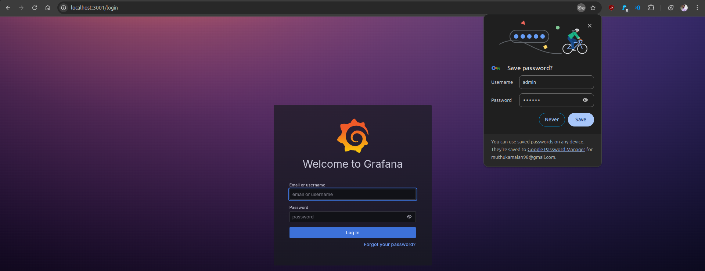
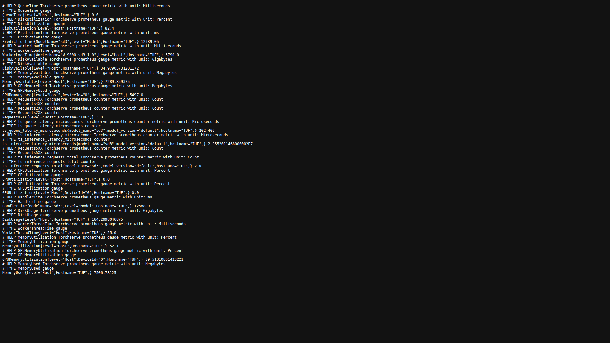
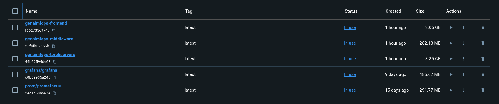

# MLOps at GenAI

<div align="center">
# Technologies Used

[](https://github.com/pre-commit/pre-commit)
[](https://pytorch.org/get-started/locally/)
[](https://pytorchlightning.ai/)
[](https://black.readthedocs.io/en/stable/)
[](https://pycqa.github.io/isort/) 
  <br>


 <br>

<br>
<br>
 

<br>


 
 <br>

<br>
[](https://github.com/ashleve/lightning-hydra-template#license)

</div>
Over the past weeks, I had the incredible opportunity to work on a project deploying Stable Diffusion—a state-of-the-art generative AI model—and taking it from concept to production. Here's what I built:

✨ Model Deployment:

Deployed Stable Diffusion on TorchServe, ensuring it’s scalable and production-ready. Automated model artifact storage by pushing to Amazon S3 for seamless accessibility.

⚡ Async API Wrapping:

Supercharged the TorchServe APIs by wrapping them with FastAPI, enabling asynchronous performance for ultra-responsive endpoints.

🎨 Frontend Integration:

Developed an interactive frontend using Next.js that dynamically pulls images from S3, making it user-friendly and visually engaging.

📊 System Observability:

Set up Prometheus and Grafana for real-time system monitoring, ensuring stability, transparency, and insightful performance tracking. No blind spots.

🐳 Reproducibility Simplified:

Built the entire stack with Docker Compose, making it effortless for anyone to reproduce the pipeline in any environment.

This project brought together my love for MLOps, GenAI, and building scalable, observable systems. It was a fantastic opportunity to work at the intersection of cutting-edge AI and production-level systems!

# Reproduce
For reproducbility Once you ready with,
- `*.mar`
- `.env` AWS Keys

```Dockerfile
docker compose up 
```

Bang!!💥💢💣🤯 Now you’re able to replicate everything, end-to-end. From model serving to frontend interaction, it’s all reproducible and production-ready.


# MindMap




# Structure
```bash
├── backend
│   ├── config.properties
│   ├── Dockerfile.torchserve
│   ├── images
│   │   ├── generated_000.png
│   │   ├── generated_001.png
│   │   ├── generated_002.png
│   │   ├── generated_003.png
│   │   ├── generated_004.png
│   │   └── generated_005.png
│   ├── logs
│   ├── metrics.yaml
│   ├── model_store
│   │   └── sd3.mar                       ## need to place sd3.mar
│   ├── notebook
│   │   ├── gen_images.py
│   │   ├── S3Touch.py
│   │   ├── sample-server.py
│   │   └── sd3.ipynb
│   ├── prompts.txt
│   ├── README.md
│   ├── requirements.txt
│   ├── sd3_handler.py
│   └── swagger.json
├── frontend
│   ├── app
│   │   ├── error.tsx
│   │   ├── favicon.ico
│   │   ├── globals.css
│   │   ├── layout.tsx
│   │   ├── page.tsx
│   │   └── providers.tsx
│   ├── components
│   │   ├── icons.tsx
│   │   ├── images-grid.tsx
│   │   ├── navbar.tsx
│   │   ├── prompt-input.tsx
│   │   └── theme-switch.tsx
│   ├── config
│   │   ├── fonts.ts
│   │   └── site.ts
│   ├── Dockerfile.next
│   ├── lib
│   │   └── atoms.ts
│   ├── next.config.js
│   ├── package.json
│   ├── .env.local                  ## need `.env.local` file
│   ├── package-lock.json
│   ├── postcss.config.js
│   ├── public
│   │   ├── images
│   │   │   └── result.jpeg
│   │   ├── next.svg
│   │   └── vercel.svg
│   ├── README.md
│   ├── tailwind.config.ts
│   ├── tsconfig.json
│   └── types
│       └── index.ts
├── grafana
│   └── datascource.yaml
├── middleware
│   ├── app.py
│   ├── Dockerfile.fastapi
│   └── requires.txt
├── prometheus
│   ├── prometheus.yml
│   └── README.md
├── .env.example
├── compose.yaml
├── pyproject.toml
└── README.md
```


## Frontend:: Next.js 🌍🕸🌐
1. create `.env.local` with SDXL FastAPI Server EndPoint
2. NEXT_PUBLIC_BACKEND_URL=`http://localhost:9080`
3. RUN with `npm run dev`



## Backend:: Torchserve 🖧🗄️
1. create a torch-model-archiver file
```bash
torch-model-archiver --model-name sd3 --version 1.0 --handler sd3_handler.py --extra-files sd3-model.zip -r requirements.txt  --archive-format zip-store

mv sd3.mar model_store/
```
2. start torchserve
```bash
torchserve --start --ts-config=config.properties --model-store model_store --models sd3=sd3.mar --disable-token-auth --ncs --enable-model-api 
```
3. checkout 
```bash
curl http://localhost:8082/metrics  # metrics API

# management API
curl http://localhost:8081/models  
curl http://localhost:8081/models/sd3 
curl -v -X PUT "http://localhost:8081/models/sd3?min_workers=1&batch_size=10"

# inference API
curl http://localhost:8080/ping                                     ## returns `healthy`
curl -X OPTIONS http://localhost:8080 > swagger.json                ## get swaggers.json
curl http://localhost:8080/predictions/sd3 -F 'data=@prompts.txt'   ## send bunch of  text
curl http://localhost:8080/predictions/sd3?text=cat                 ## send single text
```



## Middleware:: FastAPI🚀
It wraps your backend API and expose neccessary APIs to User




## Monitoring:: Prometheus
What's there after deployment?? **"Observability"**
- checking targets are in availability and showing usage report





## Reproducibility

Added sufficient Dockerfile to make this experiment reproduce.



## TODO: Always room for Improvement
- [ ] *gRPC* Protocol to Improve Performance 
- [ ] Monitor number of request coming and observe FastAPI Container
- [ ] More Viz on grafana 🖌️👨‍🎨


